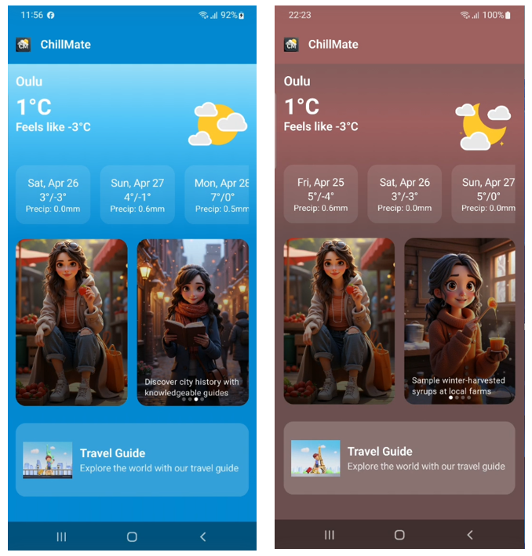

# 🌤️ ChillMate – Smart Weather & Outfit Companion 🌦️👕

[](https://opensource.org/licenses/MIT)
[](https://kotlinlang.org)
[](https://developer.android.com/jetpack/compose)

## Description

**ChillMate** is a mobile app designed to provide **real-time weather updates** along with **personalized outfit recommendations** to help users dress appropriately for rapidly changing weather conditions. Beyond weather insights, the app offers **shopping guidance** for the best clothing and outfit suppliers, suggests **outdoor activities** suited to the weather, and even helps users **pre-plan their outfits** for vacations or trips.

## Features ✨

- ✅ **Weather-Based Outfit Suggestions** – Receive real-time outfit recommendations tailored to live weather conditions.
- ✅ **Shopping Assistance** – Find the best stores for weather-appropriate outfits and gear.
- ✅ **Outdoor Activity Suggestions** – Discover activities that suit the day’s weather conditions.
- ✅ **Trip & Vacation Preparation** – Plan your wardrobe ahead of time for upcoming trips.

### 🌦️ Smart Weather Integration
- Real-time weather updates using device GPS
- 7-day forecast with temperature/precipitation
- Severe weather alerts system

### 👗 Context-Aware Outfit System
- Temperature-based clothing recommendations
- Layering suggestions for changing conditions
- Direct shopping links for recommended items

### 🎯 Activity Suggestions
- Weather-appropriate outdoor/indoor activities
- Detailed equipment checklists
- Price level indicators (Free/€/€€/€€€)

### ✈️ Travel Preparation
- Vacation wardrobe planner
- Packing list generator

## Flowchart


## Team

| Name               | GitHub Name      | Role                           |
| ------------------ | ---------------- | ------------------------------ |
| Sujeewa            | SampathHM        | Developer/Project Management   |
| Nadeesha           | t3rana00         | Developer/Designer             |
| Hasitha            | hasiya89         | Developer/Tester               |

## 🙏 Credits

Special thanks to **jochang** for sharing public Lottie animations used in ChillMate.  
Animations sourced from: [LottieFiles - vdr0uy2wwsoljqtc](https://lottiefiles.com/vdr0uy2wwsoljqtc)

All assets are used under the license provided by LottieFiles and the respective creators.

## Tech Stack 🛠️

- **Development:** Android Studio + Kotlin (Jetpack Compose)
- **Weather Data:** Integrated API for real-time weather updates

### Core Components
- **Frontend**: Jetpack Compose (100% Kotlin)
- **Architecture**: MVVM with Clean Architecture
- **Animations**: Lottie for weather visualizations

### Key Libraries
- **Retrofit 2** - Weather API integration
- **Coil** - Image loading
- **Geocoder** - Location processing
- **Material 3** - Modern UI components

### APIs Used
- **Open-Meteo** - Global weather data
    - https://open-meteo.com/
- **GeoNames** - City database for travel planning
    - http://geodb-free-service.wirefreethought.com/v1/geo/cities?namePrefix=oul&limit=10

## Device Features Used 📱

| Feature               | Usage                                  |
|-----------------------|----------------------------------------|
| GPS Location          | Real-time weather data collection      |
| Network Status        | API call management                    |

## 🔐 Permissions

ChillMate requests the following permissions:

- `ACCESS_FINE_LOCATION` – To fetch accurate weather data based on user location
- `INTERNET` – To communicate with external APIs
- `ACCESS_NETWORK_STATE` – To check network availability

## WireFrames


## 📸 Screenshots

## 🏠 Home Page Overview

**ChillMate** is your intelligent weather companion that transforms raw climate data into **actionable lifestyle recommendations**. The home page acts as the **command center**, seamlessly blending *real-time GPS-powered weather updates* to enhance your daily routine.

### 📍 Location & Weather Info
- **Current location** is detected using **device GPS** and displayed via **Geocoder**.
- Real-time weather data fetched from the **Open-Meteo API**, including:
  - **Current temperature**
  - **Feels-like temperature**
- Visualized using **Lottie animations** to reflect the current weather behavior.

### 📅 7-Day Weather Forecast
- Interactive slider shows **daily and nightly temperature averages**.
- Displays **mean daily precipitation** for each of the upcoming 7 days.

### 👕 Outfit Suggestions
- The **left side of the screen** displays **current outfit suggestions** based on temperature.
- Tailored layering recommendations for **changing weather conditions**.

### 🎯 Activity Suggestions
- The **right side of the screen** rotates through **activity recommendations** suitable for the day’s weather.
- Suggestions include both **indoor and outdoor** options depending on conditions.

### ✈️ Travel Planner Access
- A quick link to the **travel guide section** helps users plan future trips with weather-ready outfit tips.


### 🌗 Dynamic Day & Night Theme

ChillMate enhances user experience with an **adaptive color scheme** that changes automatically based on the actual **sunrise and sunset times** fetched from the weather API.

- ☀️ During the day, the app displays a **bright and fresh color palette**, offering a clear and lively UI.
- 🌙 At night, it transitions into a **softer, darker theme**, ensuring eye comfort and an immersive feel.

This seamless transition is powered by real time **sun cycle data** provided by the **Open Meteo API**, making ChillMate not just smart—but visually aware of the time of day.

#### Home Page – Day and Night Theme



### 👕 Smart Outfit Guidance & Seamless Shopping

ChillMate elevates daily outfit decisions with **personalized clothing suggestions** that adapt to real-time weather conditions and your lifestyle needs.

- 👗 **Outfit Recommendations** are generated dynamically based on **temperature**, **humidity**, **wind chill**, and **precipitation** data.
- 🧥 Provides **layering advice** for variable conditions like cold mornings and warm afternoons.
- 🛒 **Direct shopping links** to curated stores allow users to **quickly find** and **purchase** recommended outfits and gear.

This feature bridges **weather insights** with **shopping convenience**, offering a complete solution from **what to wear** to **where to buy** all inside ChillMate.

#### 🧥 Outfit Guidance  and Shopping Page


### 🏃‍♂️ Weather-Based Activity Suggestions

ChillMate helps users make the most of their day with **smart outdoor activity suggestions** tailored to the current weather conditions.

- ☀️ On sunny days, discover activities like **hiking**, **cycling**, or **picnics**.
- 🌧️ On rainy or cold days, get recommendations for **indoor activities** like **museum visits**, **indoor sports**, or **movie marathons**.
- 🧠 Suggestions are based on **real-time weather parameters** such as **temperature**, **wind speed**, and **precipitation**.

This feature ensures users stay **active, safe, and engaged** no matter what the weather brings.

---

### 📖 Detailed Activity Descriptions

Every suggested activity comes with a **detailed description page** providing useful insights to help users plan better.

- ℹ️ **Activity overview** with preparation tips.
- 🎯 **Weather suitability** indicators to match current conditions.
- 🧳 **Essential gear and clothing advice** to enjoy activities safely and comfortably.

This ensures users are fully informed and ready to enjoy every experience to the fullest!

#### 📚 Activity Description Page


### ✈️ Travel Planner – Outfit Preparation for Trips

ChillMate takes the stress out of packing with a **smart travel planning tool** that recommends **weather-appropriate outfits** for your trips.

- 📍 Input your **travel destination** and **trip dates**.
- 👕 Receive **personalized outfit recommendations** based on forecasted temperatures, rain chances, and wind conditions.
- 🎒 Plan your suitcase efficiently with **packing checklists** for each day.

This feature ensures that travelers are **perfectly prepared**—no surprises, no overpacking, just the right clothes for every day of the trip.

#### 🌍 Travel Planner Page


## 📈 Project Management and Contributions

- 🗂️ **Project Board**: [View ChillMate's Project Planning Board](https://github.com/orgs/Mobile-Development-Project-Group-14/projects/1)  
  Our project board efficiently managed **62 backlog items** throughout development:
  - ✅ Completed **17 Features**
  - ✅ Completed **34 Tasks**
  - 🛠️ Fixed **11 Bugs**

  Additional highlights:
  - 📊 **Progress View** showing work completed by each assignee.
  - 🛣️ **Roadmap** presenting all tasks completed along with their timeframes.


- 🌐 **Repository Collaboration and Network**: [View ChillMate's Repository Network](https://github.com/Mobile-Development-Project-Group-14/ChillMate/network)  
  We maintained a **structured branching strategy** to ensure smooth collaboration:
  - 🌿 Each member worked on their own branch: `SujeewaBranch`, `Nadeesha`, and `Hasitha`.
  - 🔀 Development was done individually on personal branches, followed by **pull requests** for code reviews.
  - ✅ A total of **83 pull requests** were made and reviewed by the project manager before merging into the `master` branch.

  This approach provided a **hassle-free development experience**, improving our skills in:
  - 📚 Using **GitHub Project Board** for task tracking.
  - 🌿 Managing **branches and pull requests** for collaborative software development.

  It was a valuable learning experience that enhanced our understanding of professional project workflows!


## ⚙️ Installation

1. Clone the repository:
```bash
git clone https://github.com/Mobile-Development-Project-Group-14/ChillMate